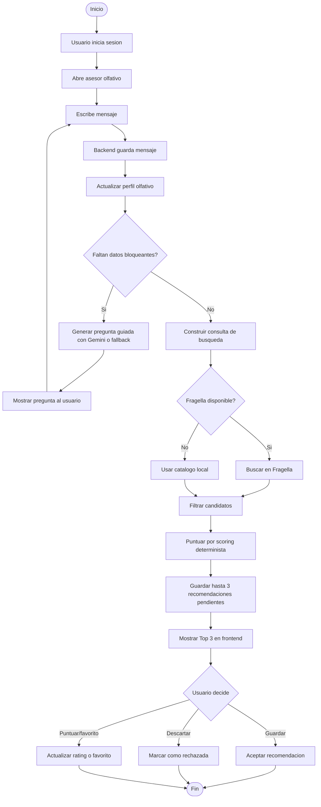

## Diagrama

## Explicacion

La actividad central es iterativa. Mientras faltan datos importantes, PerfumIA pregunta una sola cosa mas. Cuando el perfil es suficiente, se consulta catalogo, se filtra, se puntua y se devuelve el Top 3.
