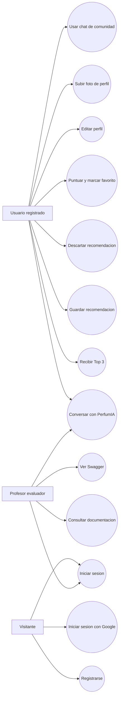

## Diagrama

## Actores

| Actor | Descripcion |
| --- | --- |
| Visitante | Persona que aun no ha iniciado sesion. Puede registrarse o entrar. |
| Usuario registrado | Persona autenticada que usa el asesor, perfil, recomendaciones y comunidad. |
| Profesor evaluador | Persona que revisa el proyecto, documentacion, Swagger y demo. |

## Casos principales

El caso de uso central es conversar con PerfumIA hasta generar recomendaciones. Alrededor de ese flujo aparecen acciones secundarias: guardar, descartar, puntuar, marcar favorito, editar perfil y participar en comunidad.
