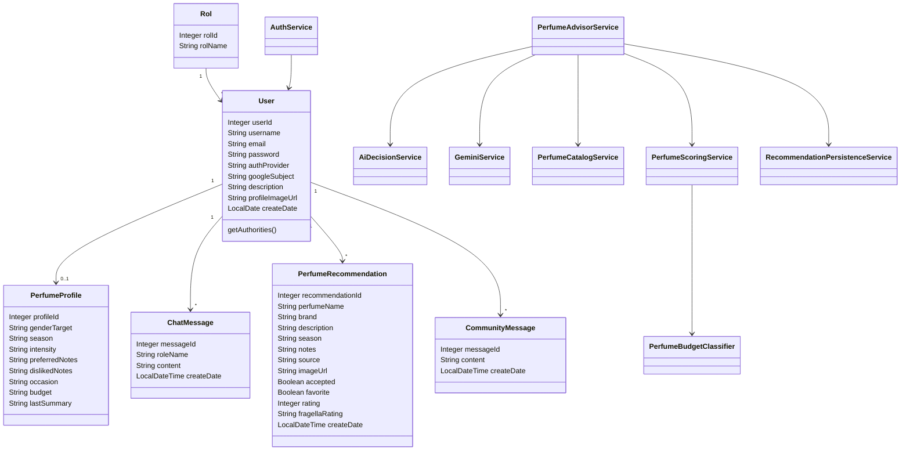

## Diagrama

## Lectura del diagrama

Las clases de entidad representan el modelo persistente. Los servicios contienen la logica de negocio. `PerfumeAdvisorService` es el orquestador del flujo principal y delega en servicios especializados para IA, catalogo, scoring y persistencia.
