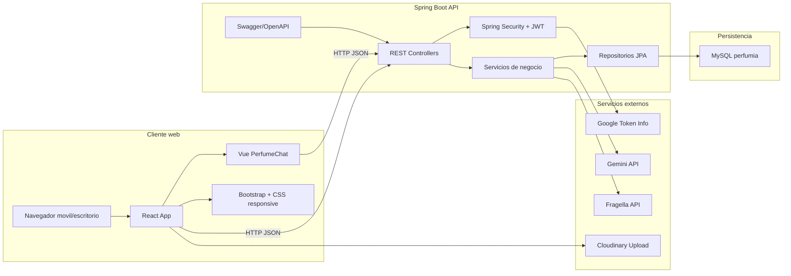

## Diagrama

## Componentes destacados

- React administra aplicacion, sesion, perfil y comunidad.
- Vue administra el chat, las cards y el auto-scroll.
- Spring Boot expone endpoints REST protegidos.
- MySQL mantiene usuarios, perfiles, mensajes y recomendaciones.
- Gemini mejora la conversacion.
- Fragella aporta catalogo externo.
- Cloudinary aloja la imagen de perfil.
