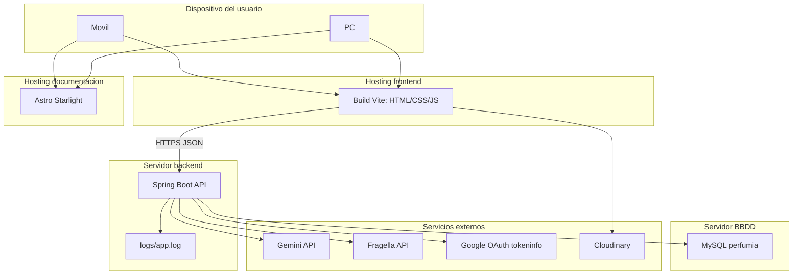

## Diagrama

## Despliegue objetivo

- El frontend se publica como build estatico de Vite.
- El backend se ejecuta como aplicacion Spring Boot con variables de entorno.
- MySQL se ejecuta en un servicio de base de datos persistente.
- Starlight se puede publicar como documentacion estatica.
- Google, Gemini, Fragella y Cloudinary se configuran con claves reales y dominios autorizados.

## Requisito de entrega

El profesor debe poder abrir la aplicacion desde el movil mediante una URL publica. Antes de entregar, prueba el enlace desde datos moviles o desde otro dispositivo para confirmar que no depende de `localhost`.
