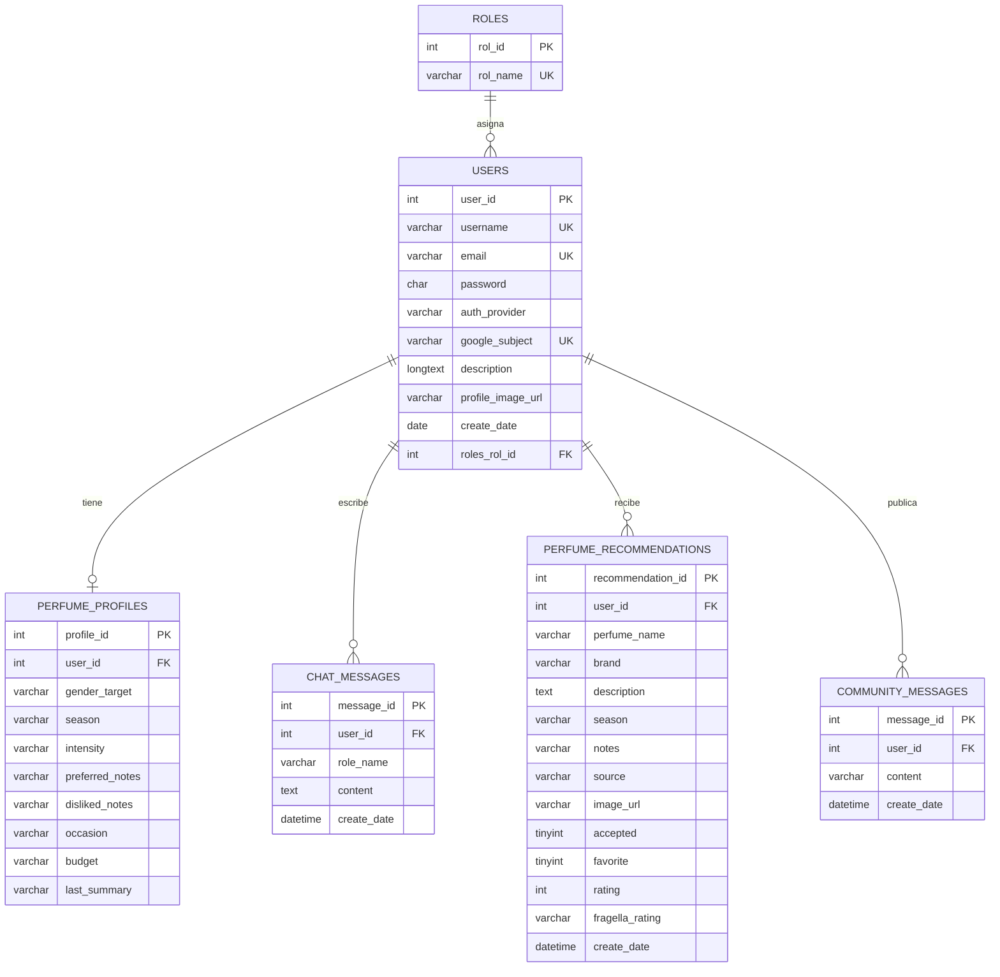

## Diagrama

## Integridad

El modelo usa claves foraneas para que los datos dependan siempre de un usuario real. En las tablas de historial, recomendaciones y comunidad se usa `ON DELETE CASCADE` para limpiar datos del usuario si se elimina su cuenta.

Ademas, se incluyen indices compuestos para optimizar las consultas mas frecuentes por usuario, fecha, estado y perfume.
