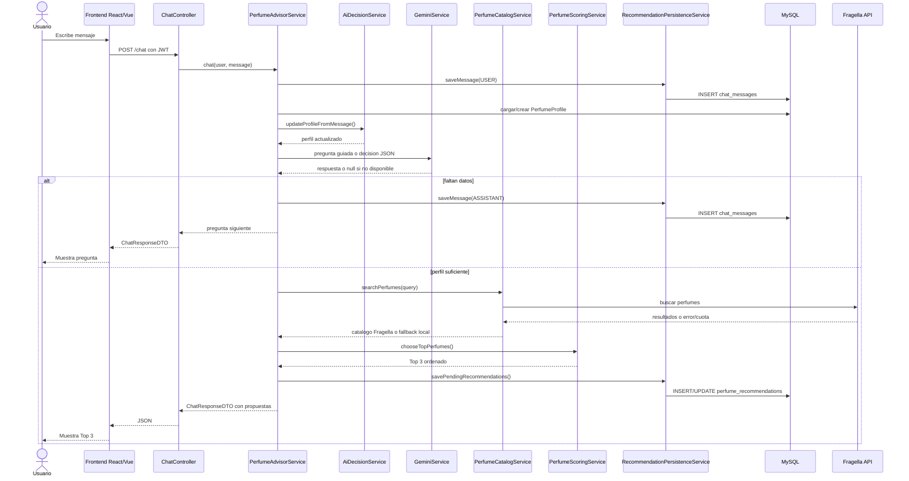

## Diagrama

## Puntos clave

Gemini participa en la conversacion, pero la seleccion final pasa por servicios propios. Esto evita que una respuesta generativa rompa las reglas de presupuesto, genero, temporada o historial.
